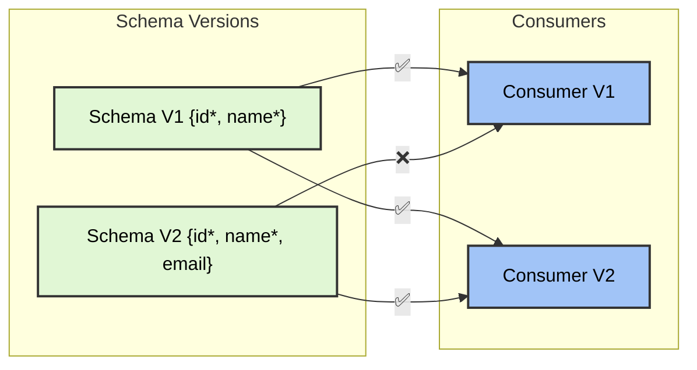
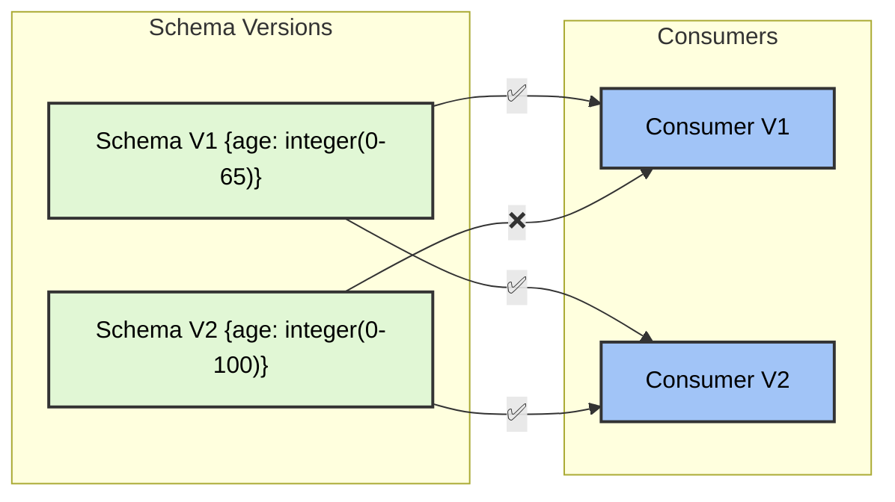
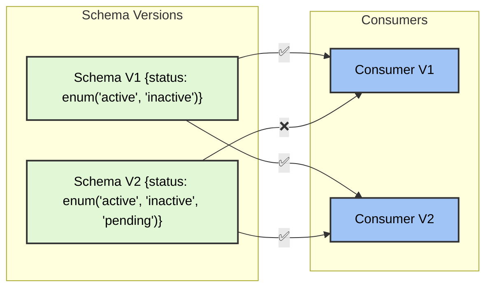
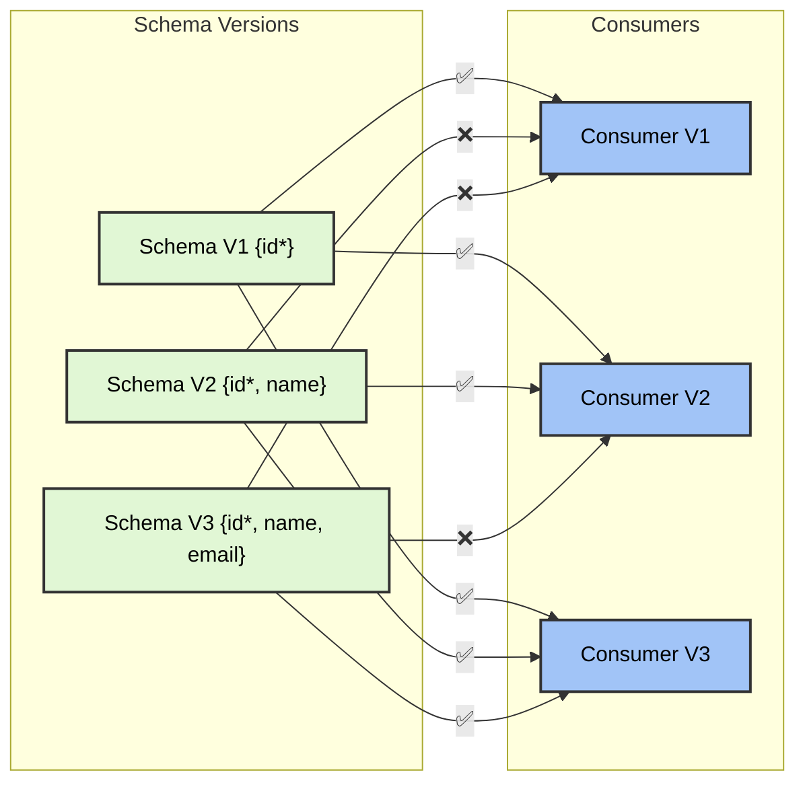
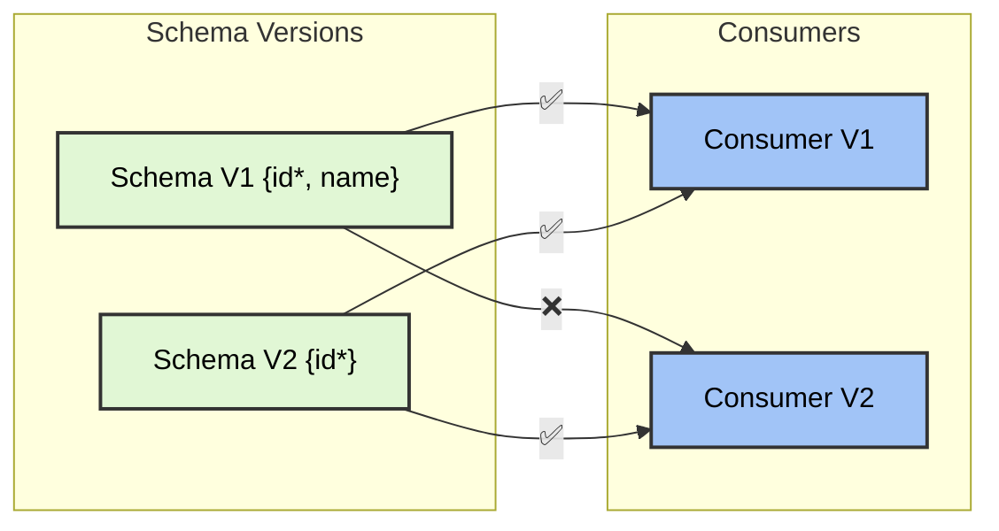
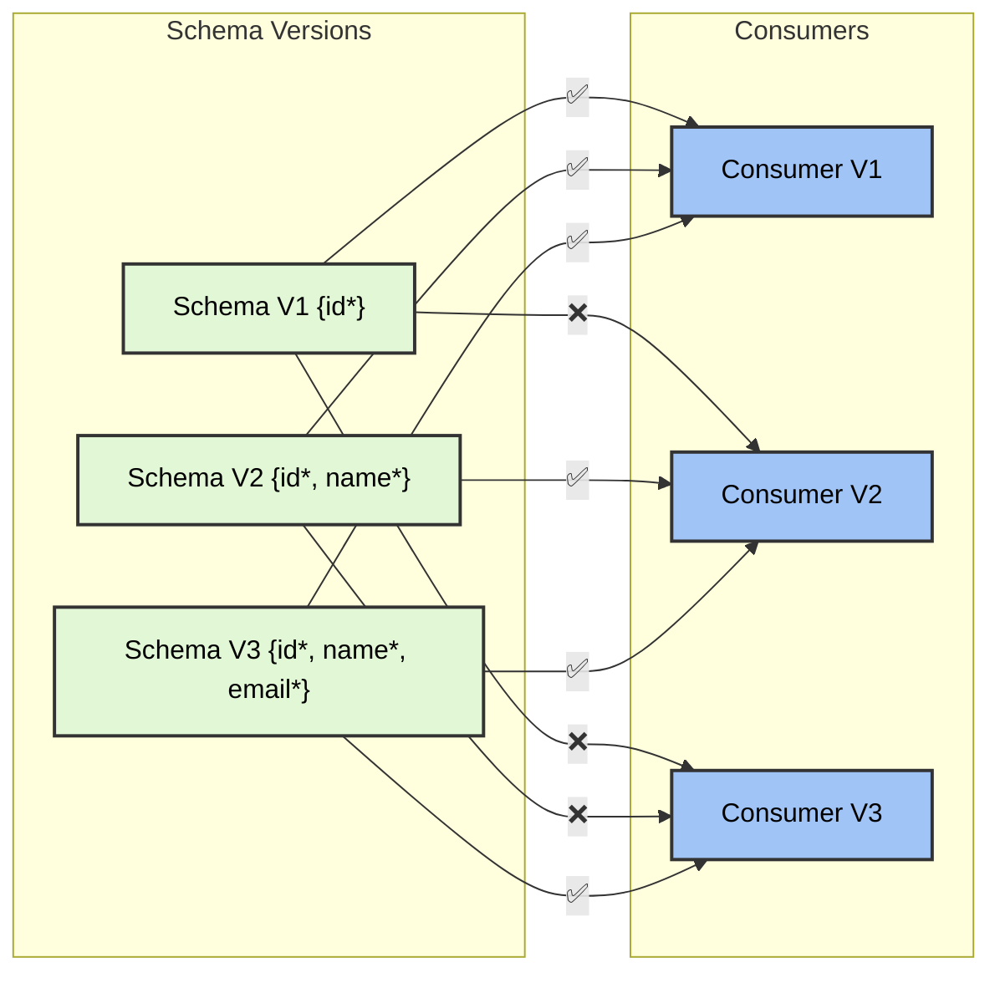
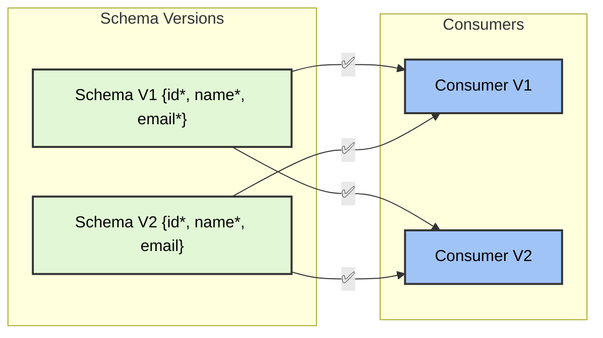
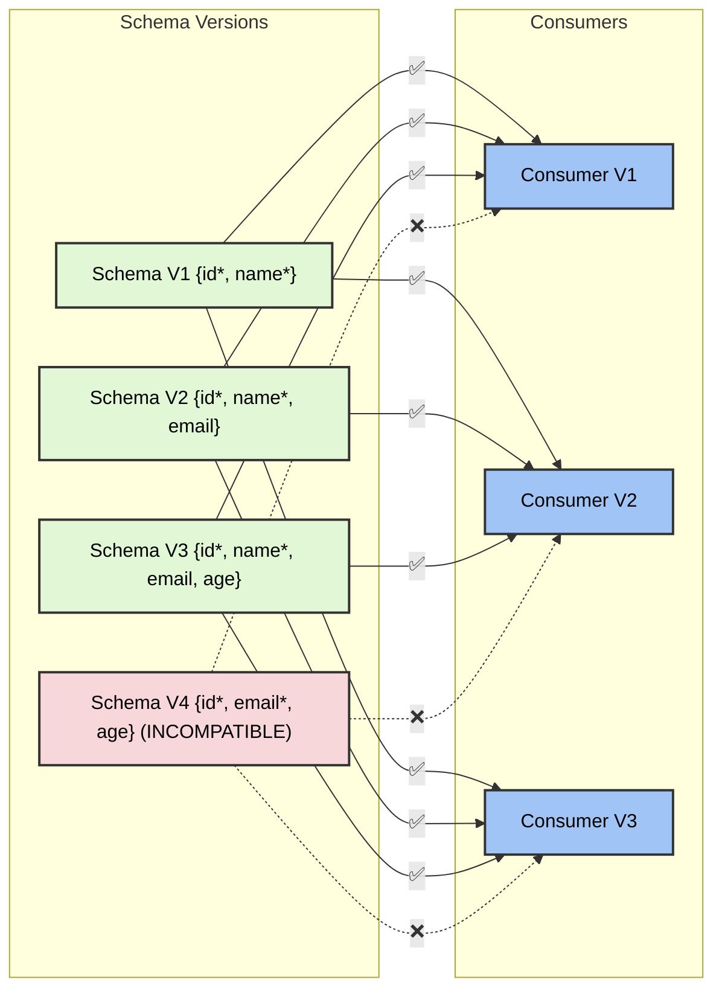

# Schema Registry Compatibility Modes

## Summary

### JSON Schema

- [BACKWARD Mode](#backward-mode)

  - Allowed transformations
    - [Adding optional fields](#Adding-optional-fields)
    - [Making required fields optional](#Making-required-fields-optional)
    - [Widening value ranges](#Widening-value-ranges)
    - [Adding enum values](#Adding-enum-values)
    - [Relaxing string patterns](#Relaxing-string-patterns)
    - [Adding new types to unions](#Adding-new-types-to-unions)
  - Non-allowed transformations
    - [Removing fields](#Removing-fields)
    - [Adding required fields](#Adding-required-fields)
    - [Changing property types](#Changing-property-types)
    - [Narrowing value ranges](#Narrowing-value-ranges)
    - [Removing enum values](#Removing-enum-values)
    - [Restricting string patterns](#Restricting-string-patterns)
    - [Adding additionalProperties: false](#Adding-additionalProperties-false)

- [BACKWARD_ALL Mode](#backward_all-mode)

  - Allowed transformations
    - All transformations allowed in BACKWARD mode
  - Non-allowed transformations
    - Same as BACKWARD mode but checked against all previous schema versions

- [FORWARD Mode](#forward-mode)

  - Allowed transformations
    - [Removing optional fields](#Removing-optional-fields)
    - [Adding required fields](#Adding-required-fields-forward)
    - [Narrowing value ranges](#Narrowing-value-ranges-forward)
    - [Removing enum values](#Removing-enum-values-forward)
    - [Making string patterns more restrictive](#Making-string-patterns-more-restrictive)
  - Non-allowed transformations
    - [Adding optional fields](#Adding-optional-fields-forward)
    - [Removing required fields](#Removing-required-fields)
    - [Changing property types](#Changing-property-types-forward)
    - [Widening value ranges](#Widening-value-ranges-forward)
    - [Adding enum values](#Adding-enum-values-forward)

- [FORWARD_ALL Mode](#forward_all-mode)

  - Allowed transformations
    - All transformations allowed in FORWARD mode
  - Non-allowed transformations
    - Same as FORWARD mode but checked against all previous schema versions

- [FULL Mode](#full-mode)

  - Allowed transformations
    - Intersection of transformations allowed in both BACKWARD and FORWARD modes
  - Non-allowed transformations
    - Union of transformations not allowed in either BACKWARD or FORWARD modes

- [FULL_ALL Mode](#full_all-mode)
  - Allowed transformations
    - All transformations allowed in FULL mode
  - Non-allowed transformations
    - Same as FULL mode but checked against all previous schema versions

# JSON Schema

## BACKWARD Mode

- **New consumers** can read data from the **immediate previous schema version**.
- **Old consumers** **cannot** read new data.

### Adding optional fields

### Making required fields optional

### Widening value ranges

### Adding enum values

---

## BACKWARD_ALL Mode

- **New consumers** can read data from **all previous schema versions**.
- **Old consumers** **cannot** read new data.

### Adding optional fields

---

## FORWARD Mode

- **Old consumers** can read data produced with new schema version.
- **New consumers** **cannot** read old data.

### Removing optional fields

---

## FORWARD_ALL Mode

- **Old consumers** can read data produced with **all new schema version**
- **New consumers** **cannot** read old data.

### Adding required fields

---

## FULL Mode

- **Both new and old consumers** can read data across schema versions.
- It checks against the **previous schema versions only** (not all past versions).

### Example

---

## FULL_ALL Mode

- Every schema version must be compatible with **all** past and future versions.
- The **strictest mode**.

### **Example:**

## Personal Notes

**Compatibility Modes**

| Mode             | Description                                         | Compatibility Behavior                                                   |
| ---------------- | --------------------------------------------------- | ------------------------------------------------------------------------ |
| **Backward**     | New schemas can read old data                       | New consumers can read data from immediate previous schema version       |
| **Backward All** | New schemas can read all old data                   | New consumers can read data from all previous schema versions            |
| **Forward**      | Old schemas can read new data                       | Old consumers can read data produced with new schema version             |
| **Forward All**  | Old schemas can read all new data                   | Old consumers can read data produced with all new schema versions        |
| **Full**         | Both new and old schemas can read each other's data | Both new and old consumers can read data across adjacent schema versions |
| **Full All**     | Both new and old schemas can read all data          | Every schema version is compatible with all past and future versions     |

## Additional Resources

- [Comparison of JSON schema validator implementations](https://www.creekservice.org/articles/2023/11/14/json-validator-comparison.html)
